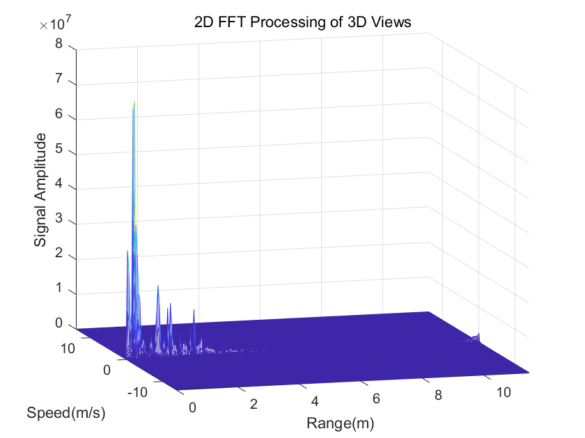
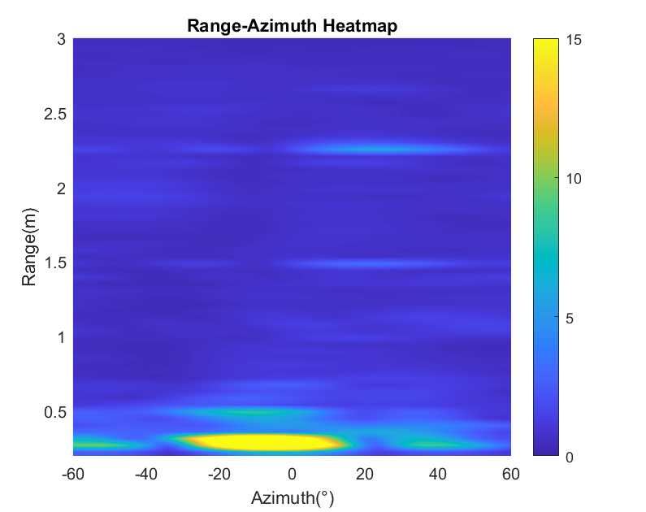
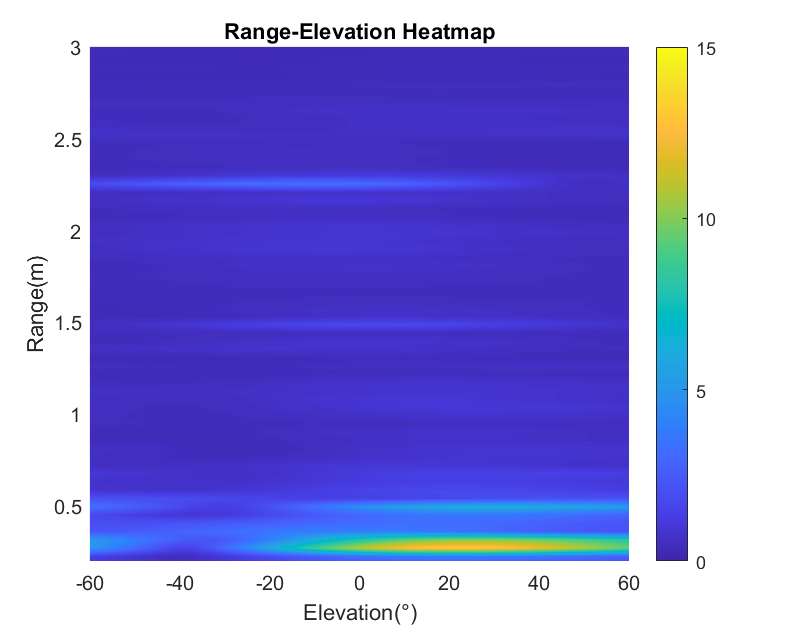
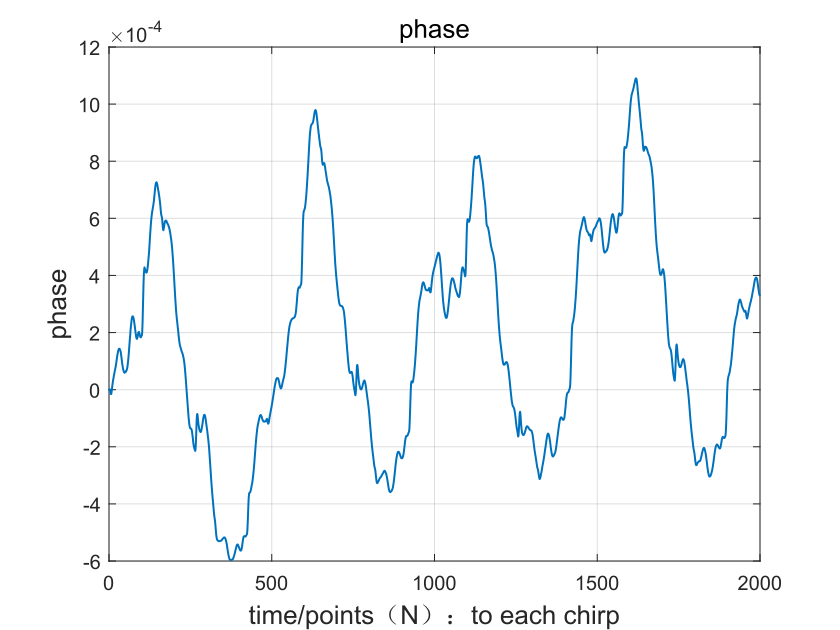
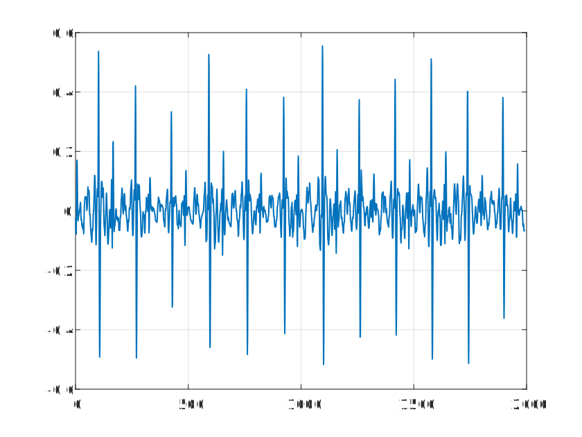
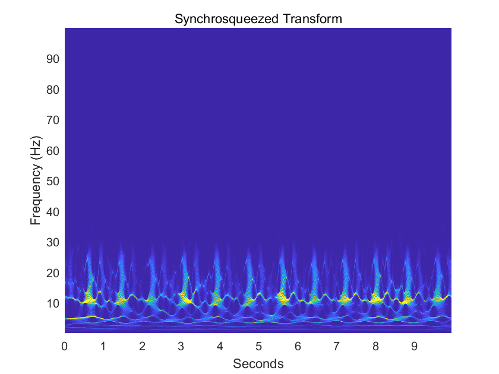
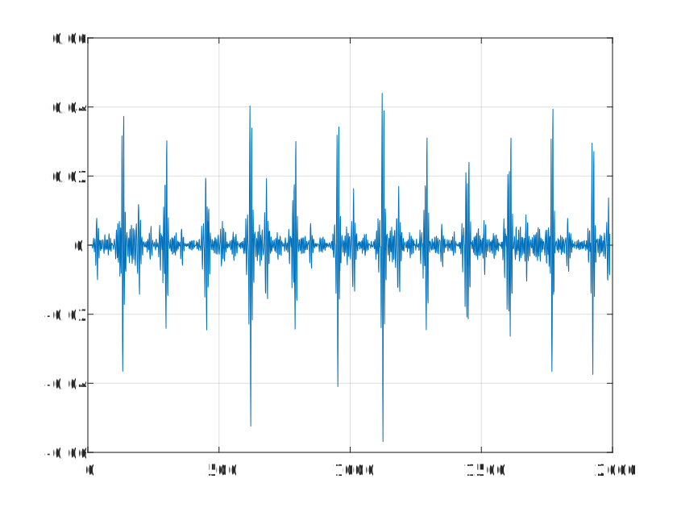
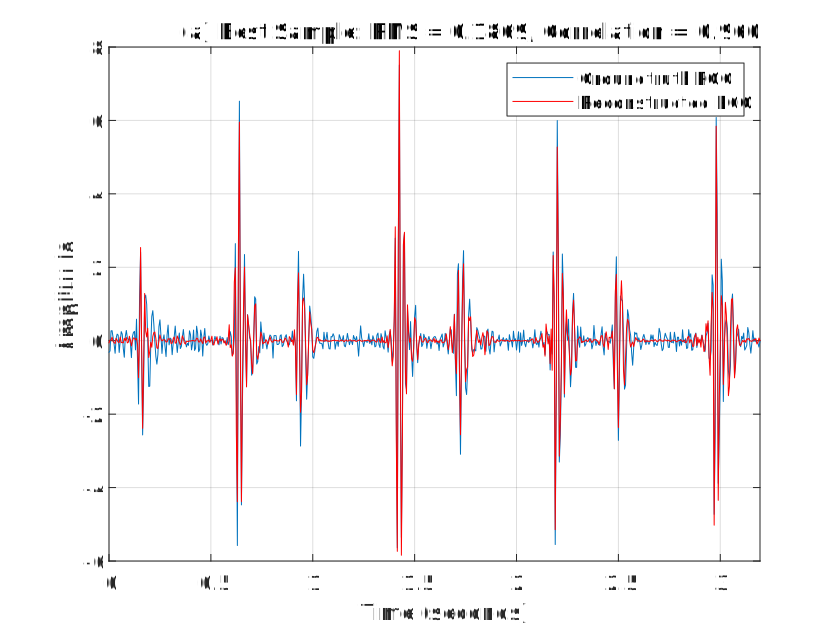

## Radar2PCG-A-Non-contact-phonocardiogram-PCG-measurement-method-using-mmWave-radar
Signal processing pipeline for cardiac mechanical activity extraction from mmWave radar and partial dataset. Code for the paper " A Deep Learning-based Non-contact Phonocardiogram Measurement Method Using mmWave Radar".
> **Paper Status:** Under Review
> ## Overview

This repository contains the **Cardiac signal extraction** (MATLAB) and partial dataset() for non-contact cardiac mechanical activity extraction from FMCW millimeter-wave radar, as described in our paper:

> Haozhe Liu, et al., "A Deep Learning-based Non-contact Phonocardiogram Measurement Method Using mmWave Radar," 2026. *(Under Review)*

The complete dataset will be made publicly available after the paper is accepted.

The proposed method achieves non-contact phonocardiogram (PCG) reconstruction from radar echoes of the human body. The signal processing pipeline extracts clean cardiac mechanical activity signals from raw radar data by integrating MDACM-based phase extraction, micro-motion amplification, and wavelet packet decomposition.
## Hardware

- **Radar:** TI IWR1843 mmWave Radar + DCA1000EVM
- **Reference Device:** Eko Core 500 Digital Stethoscope

## Requirements

- MATLAB 2022b or later
- Signal Processing Toolbox
- Wavelet Toolbox

## Results
Result of basic radar data analysis:

Result of MDACM phase extraction:

Result of Micro-motion Amplification:

Result of SST analysis:

Result of WPD subband denoising:

Network Output:

