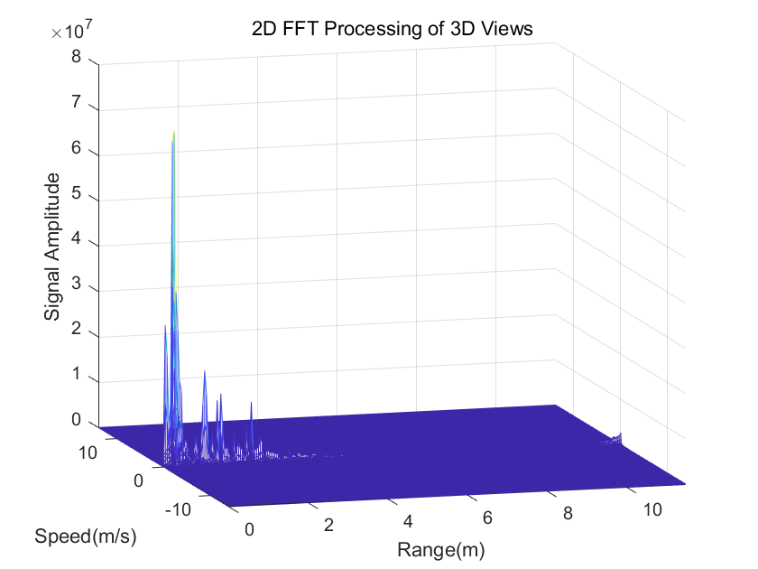
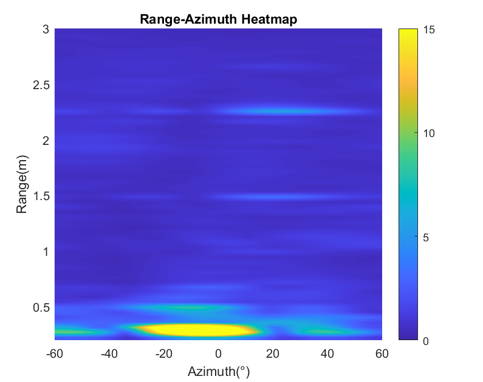
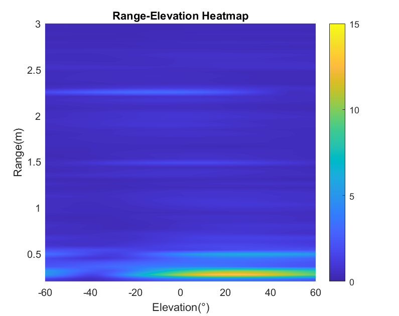
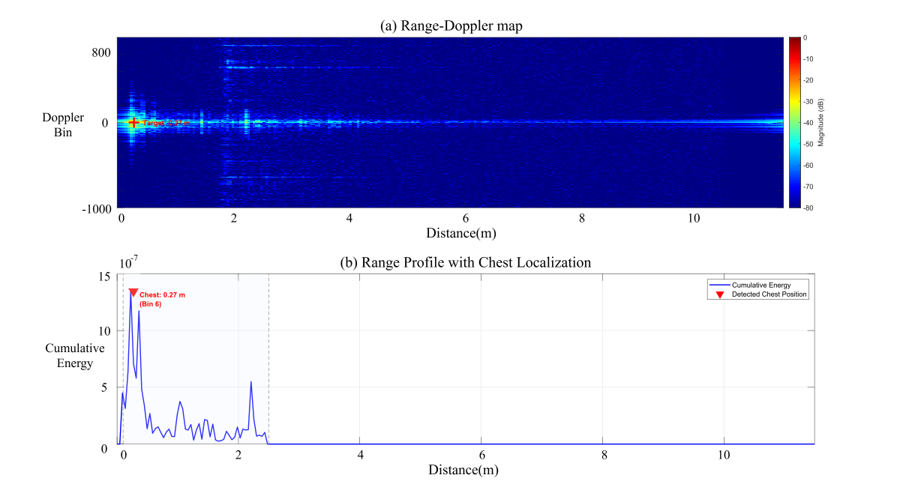
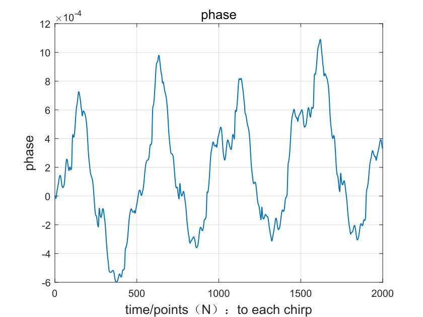
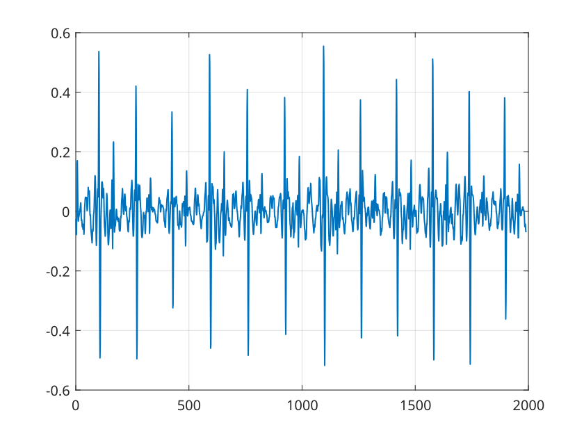
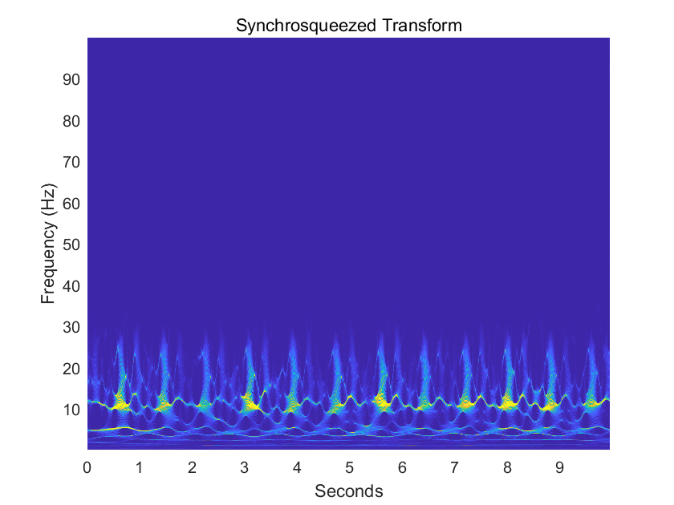
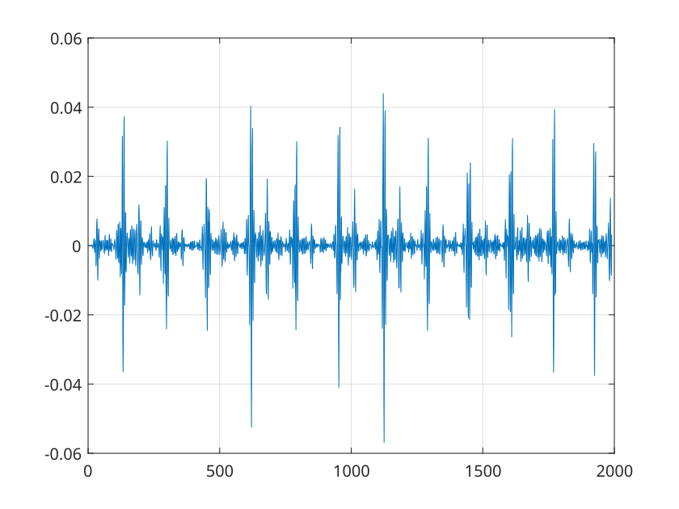
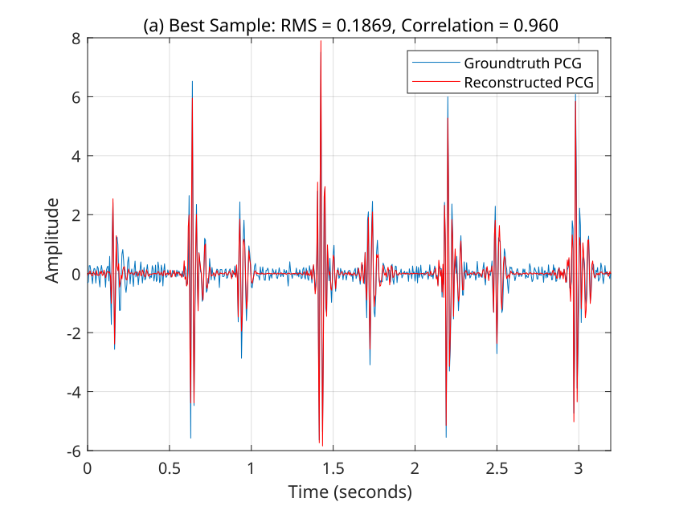

 Radar2PCG-A-Non-contact-phonocardiogram-PCG-measurement-method-using-mmWave-radar

Signal processing pipeline for cardiac mechanical activity extraction from mmWave radar and dataset. Code for the paper *"A Deep Learning-based Non-contact Phonocardiogram Measurement Method Using mmWave Radar"*.

> **Paper Status:** Published Online  
> **Journal:** *Biomedical Signal Processing and Control* (Elsevier)  
> **DOI:** [10.1016/j.bspc.2026.111190](https://doi.org/10.1016/j.bspc.2026.111190)

---

## Overview

This repository contains the **Cardiac signal extraction** (MATLAB) and dataset for non-contact cardiac mechanical activity extraction from FMCW millimeter-wave radar, as described in our paper:

> **Haozhe Liu**, **Sheng Tang**, et al., "A Deep Learning-based Non-contact Phonocardiogram Measurement Method Using mmWave Radar," *Biomedical Signal Processing and Control*, vol. 127PB, p. 111190, 2026. DOI: [10.1016/j.bspc.2026.111190](https://doi.org/10.1016/j.bspc.2026.111190).

The proposed method achieves non-contact phonocardiogram (PCG) reconstruction from radar echoes of the human body. The signal processing pipeline extracts clean cardiac mechanical activity signals from raw radar data by integrating MDACM-based phase extraction, micro-motion amplification, and wavelet packet decomposition.

---

## Citation

If you use this code or dataset in your research, please cite our paper:

## BibTeX
```bibtex
@article{LIU2026111190,
  title   = {A Deep Learning-based Non-contact Phonocardiogram Measurement Method Using mmWave Radar},
  author  = {Haozhe Liu and Sheng Tang and others},
  journal = {Biomedical Signal Processing and Control},
  volume  = {127PB},
  pages   = {111190},
  year    = {2026},
  issn    = {1746-8094},
  doi     = {https://doi.org/10.1016/j.bspc.2026.111190}
}

## Hardware

- **Radar:** TI IWR1843 mmWave Radar + DCA1000EVM
- **Reference Device:** Eko Core 500 Digital Stethoscope

## Requirements

- MATLAB 2022b or later
- Signal Processing Toolbox
- Wavelet Toolbox

## Results
- Result of basic radar data analysis:



- Result of Chest Localization:

- Result of MDACM phase extraction:

- Result of Micro-motion Amplification:

- Result of SST analysis:

- Result of WPD subband denoising:

- Network Output:


